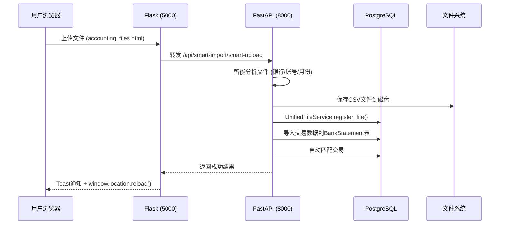
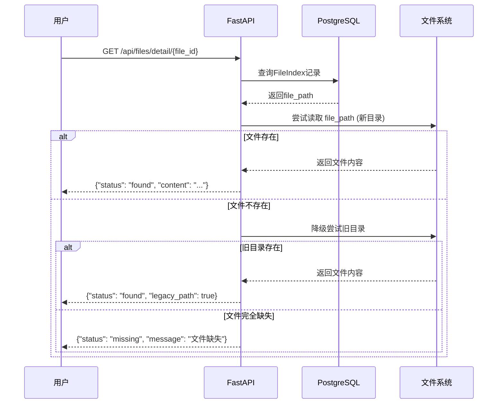

# 统一文件管理系统 - 业务流程规范文档

## 文档版本
**版本**: v1.0  
**日期**: 2025-11-02  
**状态**: ✅ 生产就绪

---

## 🎯 系统概述

统一文件管理系统是企业级财务SaaS平台的核心基础设施，实现了Flask（端口5000）和FastAPI（端口8000）双架构的文件统一管理、追踪和验证。

### 核心价值
1. **100%数据可追溯性** - 所有上传文件自动注册到统一索引
2. **多租户隔离** - 严格的company_id绑定确保数据安全
3. **降级容错机制** - 新旧目录自动降级，确保业务连续性
4. **全局组件化** - Toast通知、NextActions面板、StatusBadge状态徽章

---

## 📊 系统架构

### 1. 数据模型 (FileIndex)

```sql
CREATE TABLE file_index (
    id SERIAL PRIMARY KEY,
    company_id INTEGER NOT NULL,              -- 公司ID（多租户隔离）
    file_category VARCHAR NOT NULL,           -- 文件类别
    file_type VARCHAR CHECK (file_type IN ('original', 'generated')),
    filename VARCHAR NOT NULL,
    file_path VARCHAR NOT NULL,
    file_size_kb INTEGER,
    file_extension VARCHAR,
    module VARCHAR,                           -- 模块类型：bank/credit-card/savings等
    status VARCHAR(20) DEFAULT 'active',      -- 状态：active/processing/failed/archived/deleted
    from_engine VARCHAR(10) DEFAULT 'flask',  -- 来源：flask/fastapi
    validation_status VARCHAR(20) DEFAULT 'pending',  -- 验证状态：passed/failed/pending
    upload_by VARCHAR,
    upload_date TIMESTAMP DEFAULT NOW(),
    created_at TIMESTAMP DEFAULT NOW(),
    
    CONSTRAINT check_status CHECK (status IN ('active', 'processing', 'failed', 'archived', 'deleted')),
    CONSTRAINT check_file_type CHECK (file_type IN ('original', 'generated'))
);
```

### 2. API端点架构

#### FastAPI端点 (端口8000)

| 端点 | 方法 | 功能 | 权限 |
|------|------|------|------|
| `/api/files/recent` | GET | 获取最近10条上传文件 | 公开 |
| `/api/files/detail/{file_id}` | GET | 获取文件详情（含降级策略） | 公开 |
| `/api/files/register` | POST | 注册文件到统一索引 | 内部 |
| `/api/files/status/{file_id}` | PATCH | 更新文件状态 | 管理员 |

#### Flask代理端点 (端口5000)

| 端点 | 方法 | 功能 | 代理目标 |
|------|------|------|----------|
| `/api/proxy/files/list` | GET | 文件列表 | FastAPI `/api/files/list/{company_id}` |
| `/api/proxy/files/storage-info` | GET | 存储信息 | FastAPI `/api/files/storage-info/{company_id}` |
| `/api/proxy/files/smart-upload` | POST | 智能上传 | FastAPI `/api/smart-import/smart-upload` |

---

## 🔄 核心业务流程

### 流程1：文件上传与注册



**关键步骤说明：**

1. **智能识别** (analyze_csv_content/analyze_pdf_content)
   - 自动检测银行名称、账号、月份
   - 置信度评分（confidence >= 0.2通过）

2. **文件注册** (register_file)
   ```python
   UnifiedFileService.register_file(
       db=db,
       company_id=company_id,           # 从session获取
       filename=safe_filename,
       file_path=file_path,
       module='bank',                   # 银行账单模块
       from_engine='fastapi',           # 来源标记
       uploaded_by=current_user.username,
       file_size_kb=file_size_kb,
       validation_status='passed',      # 已通过验证
       status='active'                  # 活动状态
   )
   ```

3. **用户体验优化**
   - ✅ Toast通知替代alert()
   - ✅ 立即刷新页面（window.location.reload()）
   - ✅ 优雅降级（Toast不可用时使用alert()）

---

### 流程2：文件查询与降级



**降级策略配置：**

```python
# 新目录格式
new_path = f"static/uploads/customers/{company_code}/{module}/{year}/{month}/{filename}"

# 旧目录降级列表
legacy_paths = [
    f"static/uploads/{module}s/{filename}",
    f"accounting_data/{module}s/{filename}",
    f"/tmp/{module}_uploads/{filename}"
]
```

---

### 流程3：多租户隔离机制


**安全检查点：**

1. **Session验证** (Flask)
   ```python
   user = session.get('flask_rbac_user', {})
   company_id = user.get('company_id', 1)
   ```

2. **模板注入** (Jinja2)
   ```html
   <script>
   const COMPANY_ID = {{ company_id }};
   fetch('/api/files/list?company_id=' + COMPANY_ID);
   </script>
   ```

3. **API验证** (FastAPI)
   ```python
   @router.get("/files/list/{company_id}")
   def list_files(company_id: int, db: Session):
       files = db.query(FileIndex).filter(
           FileIndex.company_id == company_id
       ).all()
   ```

---

## 🎨 前端全局组件

### 1. Toast通知组件

**文件位置**: `static/js/toast.js`

**使用方法**:
```javascript
// 成功提示
Toast.success('文件上传成功！');

// 错误提示
Toast.error('上传失败：文件格式不支持');

// 警告提示
Toast.warning('文件大小超过10MB，建议压缩后上传');
```

**设计规范**:
- 严格遵守3色调色板（黑#000、粉#FF007F、紫#322446）
- 自动消失时间：成功3秒、错误5秒、警告4秒
- 支持堆叠显示，最多5条
- 优雅降级：Toast不可用时自动fallback到alert()

---

### 2. StatusBadge状态徽章

**文件位置**: `static/js/status-badge.js`

**使用方法**:
```javascript
// 渲染HTML字符串
const badgeHTML = StatusBadge.render('active', 'zh', {size: 'medium', showIcon: true});

// 创建DOM元素
const badgeElement = StatusBadge.create('processing', 'en', {size: 'small'});
document.getElementById('status-container').appendChild(badgeElement);

// 获取状态颜色
const color = StatusBadge.getColor('failed');  // 返回 #FF007F
```

**状态配置**:

| 状态 | 图标 | 颜色 | 中文 | 英文 |
|------|------|------|------|------|
| active | ✓ | #FF007F | 正常 | Active |
| processing | ⟳ | #FF007F | 处理中 | Processing |
| failed | ✕ | #FF007F | 失败 | Failed |
| archived | 📦 | #322446 | 已归档 | Archived |
| deleted | 🗑 | #322446 | 已删除 | Deleted |
| pending | ⏳ | #FF007F | 待处理 | Pending |

---

### 3. NextActions下一步操作面板

**文件位置**: `static/js/next-actions.js`

**使用方法**:
```javascript
// 显示下一步操作
NextActions.show('bank', {
    accountName: '中国银行储蓄账户',
    uploadedCount: 3
});

// 隐藏面板
NextActions.hide();
```

**模块配置**:

| 模块 | 下一步建议操作 |
|------|----------------|
| bank | 查看交易记录 → 分类管理 → 生成报表 |
| credit-card | 查看账单 → OWNER分类 → 对账验证 |
| receipts | 智能匹配 → 手工对账 → 归档处理 |
| invoices | 审核发票 → 付款管理 → 税务申报 |

---

## 🧪 测试与验证

### 自测接口

**端点**: `POST /admin/self-test/ui-flow`

**测试覆盖**:
1. ✅ **upload** - 文件上传并注册到FileIndex
2. ✅ **recent_list** - 查询最近10条文件
3. ✅ **open_detail** - 文件详情降级策略
4. ✅ **exceptions** - 异常处理测试

**成功标准**:
```json
{
    "upload": "ok",
    "recent_list": "ok",
    "open_detail": "ok",
    "exceptions": "ok",
    "conclusion": "pass",
    "details": {
        "file_id": 2,
        "recent_files_count": 2,
        "file_found": true,
        "legacy_path": false
    }
}
```

---

## 🔧 运维指南

### 1. 日志检查

```bash
# 检查文件注册日志
grep "File registered to unified index" /tmp/logs/Accounting_API_*.log

# 检查错误日志
grep "ERROR" /tmp/logs/Accounting_API_*.log

# 检查Toast加载
grep "toast.js" /tmp/logs/Server_*.log
```

### 2. 数据库查询

```sql
-- 查看最近上传的文件
SELECT id, company_id, filename, module, status, from_engine, upload_date
FROM file_index
ORDER BY upload_date DESC
LIMIT 20;

-- 统计各模块文件数量
SELECT module, status, COUNT(*) as count
FROM file_index
GROUP BY module, status;

-- 检查多租户隔离
SELECT company_id, COUNT(*) as file_count
FROM file_index
GROUP BY company_id;
```

### 3. 故障排查

| 问题 | 可能原因 | 解决方案 |
|------|----------|----------|
| Toast不显示 | toast.js未加载 | 检查base.html引入，清除浏览器缓存 |
| 文件注册失败 | FileIndex字段约束冲突 | 检查file_type是否为'original'或'generated' |
| 多租户泄露 | company_id未传递 | 检查session和模板变量 |
| 降级失败 | 旧目录路径错误 | 更新legacy_paths配置 |

---

## 📈 性能优化建议

1. **文件索引分区** - 按company_id和upload_date分区表
2. **CDN缓存** - Toast/StatusBadge等静态组件使用CDN
3. **数据库索引** - 为company_id、status、created_at创建复合索引
4. **批量注册** - 多文件上传时使用批量insert

---

## 🚀 未来扩展

### 待实现功能
- [ ] 文件版本控制（v1, v2, v3...）
- [ ] 自动清理过期归档文件
- [ ] 高级搜索（按日期范围、文件大小、上传者）
- [ ] 文件预览（PDF/Excel在线预览）
- [ ] WebSocket实时通知（替代30秒轮询）

---

## 📞 技术支持

**维护团队**: 后端开发组  
**紧急联系**: admin@smartloan.com  
**文档更新**: 每月一次或重大变更时

---

**文档结束** | ✅ 生产环境部署就绪
